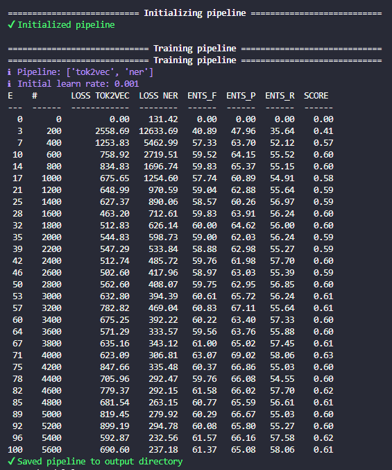

### Funções Auxiliares

#### aux_func.py

* get_text: buscar o texto no elemento root de um arquivo xml.
* get_annotations: buscar as <annotations> no elemento root de um arquivo xml.
* get_mapped_tags: mappear as <annotations> para 'pt-br', filtrando as que vão ser utilizadas.

#### filter_files.py

Devido a inconsistências na conversão das anotações, foram selecionados apenas alguns arquivos do dataset para serem utilizados no modelo.


### Execução

#### 1. Setup
```python
python -m venv venv
.\\venv\Scripts\activate

python.exe -m pip install --upgrade pip

pip install -U pip setuptools wheel
pip install -U spacy pygls
python -m spacy download pt_core_news_md
```

#### 2. JSON - generate_json.py

* linha 15 (range(**0, 250**)): determina os índices (**mín,max**) dos arquivos a serem utilizados.
*  linha 28 './json/**clin_data_0_200.json**': determina o nome do arquivo json a ser salvo.

```python
python generate_json.py
```

#### 3. SPACY - generate_spacy.py

* linha 9 './json/**clin_data_0_200.json**': determina o nome do arquivo json para buscar os dados.

```python
python generate_spacy.py
```

#### 4. Treinar o modelo

```python
python -m spacy train ./config.cfg --output ./output --paths.train ./spacy/train.spacy --paths.dev ./spacy/dev.spacy
```

#### 5. Testar

Comparativo do NER do modelo treinado com o do 'pt_core_news_md'

```python
python test.py
```

### Extra - Training Pipelines

### 20 - 100



### 0 - 200

